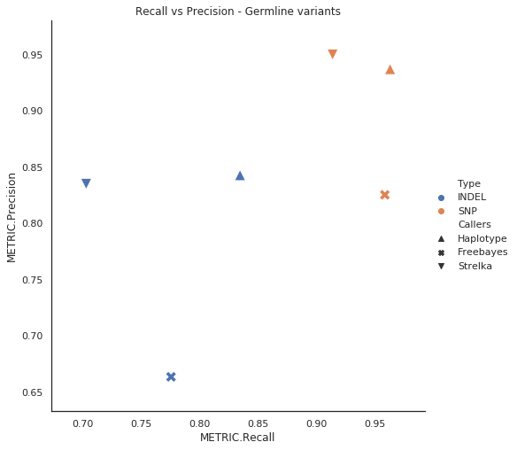

# Germline Variant calling

- NA12878 sample raw fastq data with high confidence variants set from [Genome in a Bottle GiaB](https://www.nist.gov/programs-projects/genome-bottle) project. 
- ftp link to download [NA12878](ftp://ftp-trace.ncbi.nih.gov/giab/ftp/data/NA12878/Garvan_NA12878_HG001_HiSeq_Exome)

## Sample Details:
- NA12878 (WES)
- Facility: Garvan Institute of Medical Research (http://www.garvan.org.au/)
- Sequencer: HiSeq2500
- kit: Nextera Rapid Capture Exome and Expanded Exome

NIST7035 and NIST7086 are 2 vials of NA12878 DNA, a library was made from each, each library was sequenced on 2 lanes

### Variant Callers:

* Haplotypecaller (GATK3)
* Freebayes
* Strelka-germline 

Vcf comparison and Benchmarking was done by Illumina hap.py tool for each variant caller. The summary of this report has been listed below. `hap.py` directory has all summary metrics file in csv format.

## HaplotypeCaller 

| Type  | TRUTH.TOTAL | TRUTH.TP | TRUTH.FN | QUERY.TOTAL | QUERY.FP | QUERY.UNK | FP.gt | METRIC.Recall | METRIC.Precision | METRIC.Frac_NA | METRIC.F1_Score |
| ----- | ----------- | -------- | -------- | ----------- | -------- | --------- | ----- | ------------- | ---------------- | -------------- | --------------- |
| INDEL | 7225        | 6032     | 1193     | 7248        | 1139     | 7         | 101   | 0.834879      | 0.842701         | 0.000966       | 0.838772        |
| SNP   | 49523       | 47708    | 1815     | 50924       | 3205     | 0         | 166   | 0.96335       | 0.937063         | 0              | 0.950025        |

## Freebayes

| Type  | Filter | TRUTH.TOTAL | TRUTH.TP | TRUTH.FN | QUERY.TOTAL | QUERY.FP | QUERY.UNK | FP.gt | METRIC.Recall | METRIC.Precision | METRIC.Frac_NA | METRIC.F1_Score | TRUTH.TOTAL.TiTv_ratio | QUERY.TOTAL.TiTv_ratio | TRUTH.TOTAL.het_hom_ratio | QUERY.TOTAL.het_hom_ratio |
| ----- | ------ | ----------- | -------- | -------- | ----------- | -------- | --------- | ----- | ------------- | ---------------- | -------------- | --------------- | ---------------------- | ---------------------- | ------------------------- | ------------------------- |
| INDEL | ALL    | 7350        | 5702     | 1648     | 8543        | 2865     | 33        | 249   | 0.775782      | 0.663337         | 0.003863       | 0.715167        |                        |                        | 2.46216087577             | 3.48277689454             |
| INDEL | PASS   | 7350        | 5702     | 1648     | 8543        | 2865     | 33        | 249   | 0.775782      | 0.663337         | 0.003863       | 0.715167        |                        |                        | 2.46216087577             | 3.48277689454             |
| SNP   | ALL    | 49540       | 47501    | 2039     | 57653       | 10074    | 17        | 252   | 0.958841      | 0.825213         | 0.000295       | 0.887023        | 2.40289795358          | 1.83929098966          | 1.64706825592             | 2.0142266855              |
| SNP   | PASS   | 49540       | 47501    | 2039     | 57653       | 10074    | 17        | 252   | 0.958841      | 0.825213         | 0.000295       | 0.887023        | 2.40289795358          | 1.83929098966          | 1.64706825592             | 2.0142266855              |

## Strelka-germline

| Type  | Filter | TRUTH.TOTAL | TRUTH.TP | TRUTH.FN | QUERY.TOTAL | QUERY.FP | QUERY.UNK | FP.gt | METRIC.Recall | METRIC.Precision | METRIC.Frac_NA | METRIC.F1_Score | TRUTH.TOTAL.TiTv_ratio | QUERY.TOTAL.TiTv_ratio | TRUTH.TOTAL.het_hom_ratio | QUERY.TOTAL.het_hom_ratio |
| ----- | ------ | ----------- | -------- | -------- | ----------- | -------- | --------- | ----- | ------------- | ---------------- | -------------- | --------------- | ---------------------- | ---------------------- | ------------------------- | ------------------------- |
| INDEL | ALL    | 7350        | 5683     | 1667     | 28279       | 1677     | 20966     | 237   | 0.773197      | 0.770682         | 0.741398       | 0.771938        |                        |                        | 2.46216087577             | 1.87156150936             |
| INDEL | PASS   | 7350        | 5168     | 2182     | 15483       | 1014     | 9340      | 135   | 0.703129      | 0.834934         | 0.603242       | 0.763384        |                        |                        | 2.46216087577             | 2.24170014802             |
| SNP   | ALL    | 49540       | 47412    | 2128     | 1309418     | 32791    | 1229161   | 495   | 0.957045      | 0.591425         | 0.938708       | 0.73107         | 2.40289795358          | 0.937053360151         | 1.64706825592             | 3.27512010948             |
| SNP   | PASS   | 49540       | 45285    | 4255     | 159382      | 2389     | 111657    | 182   | 0.91411       | 0.949942         | 0.700562       | 0.931682        | 2.40289795358          | 1.51854717726          | 1.64706825592             | 2.7687701193              |

## Recall vs Precision

Scatter plot to compare all variant callers recall against precision values

