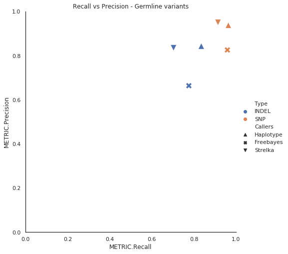

# Germline Variant calling

- NA12878 sample raw fastq data with high confidence variants set from [Genome in a Bottle GiaB](https://www.nist.gov/programs-projects/genome-bottle) project. 
- ftp link to download [NA12878](ftp://ftp-trace.ncbi.nih.gov/giab/ftp/data/NA12878/Garvan_NA12878_HG001_HiSeq_Exome)

## Sample Details:
- NA12878 (WES)
- Facility: Garvan Institute of Medical Research (http://www.garvan.org.au/)
- Sequencer: HiSeq2500
- kit: Nextera Rapid Capture Exome and Expanded Exome

NIST7035 and NIST7086 are 2 vials of NA12878 DNA, a library was made from each, each library was sequenced on 2 lanes

### Variant Callers:

* HaplotypeCaller (GATK3)
* Freebayes
* Strelka-germline 

Illumina hap.py tool is being used to compare vcf files for each germline variant callers. The summary of this report has been listed below, for detailed report can be found under `hap.py` directory as csv files.

## HaplotypeCaller - gatk-v3.8

| Type  | TRUTH.TOTAL | TRUTH.TP | TRUTH.FN | QUERY.TOTAL | QUERY.FP | QUERY.UNK | METRIC.Recall | METRIC.Precision | METRIC.Frac_NA | METRIC.F1_Score |
| ----- | ----------- | -------- | -------- | ----------- | -------- | --------- | ------------- | ---------------- | -------------- | --------------- |
| INDEL | 7225        | 6032     | 1193     | 7248        | 1139     | 7         | 0.834879      | 0.842701         | 0.000966       | 0.838772        |
| SNP   | 49523       | 47708    | 1815     | 50924       | 3205     | 0         | 0.96335       | 0.937063         | 0              | 0.950025        |

## Freebayes - v1.2.0

| Type  | TRUTH.TOTAL | TRUTH.TP | TRUTH.FN | QUERY.TOTAL | QUERY.FP | QUERY.UNK | METRIC.Recall | METRIC.Precision | METRIC.Frac_NA | METRIC.F1_Score |
| ----- | ----------- | -------- | -------- | ----------- | -------- | --------- | ------------- | ---------------- | -------------- | --------------- |
| INDEL | 7350        | 5702     | 1648     | 8543        | 2865     | 33        | 0.775782      | 0.663337         | 0.003863       | 0.715167        |
| SNP   | 49540       | 47501    | 2039     | 57653       | 10074    | 17        | 0.958841      | 0.825213         | 0.000295       | 0.887023        |

## Strelka-germline - v2.8.4
| Type  | TRUTH.TOTAL | TRUTH.TP | TRUTH.FN | QUERY.TOTAL | QUERY.FP | QUERY.UNK | METRIC.Recall | METRIC.Precision | METRIC.Frac_NA | METRIC.F1_Score |
| ----- | ----------- | -------- | -------- | ----------- | -------- | --------- | ------------- | ---------------- | -------------- | --------------- |
| INDEL | 7350        | 5168     | 2182     | 15483       | 1014     | 9340      | 0.703129      | 0.834934         | 0.603242       | 0.763384        |
| SNP   | 49540       | 45285    | 4255     | 159382      | 2389     | 111657    | 0.91411       | 0.949942         | 0.700562       | 0.931682        |

## Recall vs Precision

Scatter plot to compare all variant callers recall against precision values

