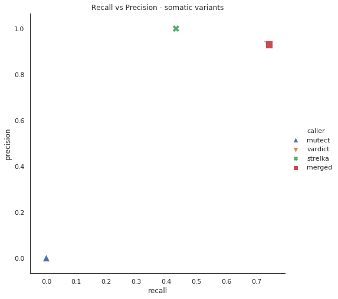

# Somatic Variant Calling

Benchmarking the somatic calls is still difficult problem due to lack of gold standard Tumor/Normal data with known somatic mutations. Here we are addressing this problem to generate semi-synthetic Tumor/Normal sample using Bamsimulator pipeline which was developed by SomaticSeq team. However, It is not exact resemblance of real tumor data but we are using real sequencing data to spike in somatic mutation which serves as pseudo-tumor. 

Based on data availability, there are three different ways to generate N/T suggested by SomaticSeq. 

- If we have replicates of same normal samples,  we can use one as normal and another as pseudo-tumor with spikedin mutation.
- If we have high coverage sample,  we can split this sample into two and use those as normal and pseudo-tumor.
- If we have normal and tumor sample, spike in known-mutation into tumor sample.

High coverage sample:

* Sample ID : ACC5403A1 (NA12878)
* Sequencing : Targeted Panel Sequencing 
* Size of the panel: 26548 bp
* Coverage: 7471x  
* Bed file: lymphomatic_v2.1_hg19.bed

We followed second method to generate reference data. This workflow will provide spikedin bam file with `synthetic-snvs.vcf` and `synthetic_indels.leftalign.vcf`. We are using multiple variant callers approach for somatic variant calling. The callers are GATK3 MuTect2, Strelka-somatic, VarDict implemented in BALSAMIC. Final vcf file can be compared with truth set using `som.py` model. It does not include genotype, compares variants with locations and alleles.

Variant callers:

* MuTect2 - GATK3
* Strelka-somatic
* VarDict

## Overview:

- Alignment
- Sorting and Indexing
- MarkDuplicates 
- Run BamSurgeon Workflow
	- Split the Bam file randomly into two  bam files
	- Designated_normal
	- Designated_tumor
	- Generate random sites for snv, indel, sv, and cnv (for given region).
	- Spike in Mutations (SNVs and INDELs)
- Convert the bam file into fastq (To run BALSAMIC)
- VCF - Validation ([som.py](https://github.com/Illumina/hap.py/blob/master/doc/sompy.md))

## Recall vs Precision

Scatter plot to compare all variant callers recall against precision values

MuTect2 didn't pass single variant from this sample which seemed weird. However, Vardict called almost 70% of the truth variants but vardict algorithym calls all variants include germline. One of the possible reason could be the small targeted panel(26kb) with more than 450 mutations spikedin. We need to redo the analysis with whole exome data to compare the performance of each caller.

In addition, We compared variant results from direct bam file which is generated from bamsurgeon. It showed some significant changes over number of variants called by strelka and vardict. But there was no change in MuTect2's performance.

